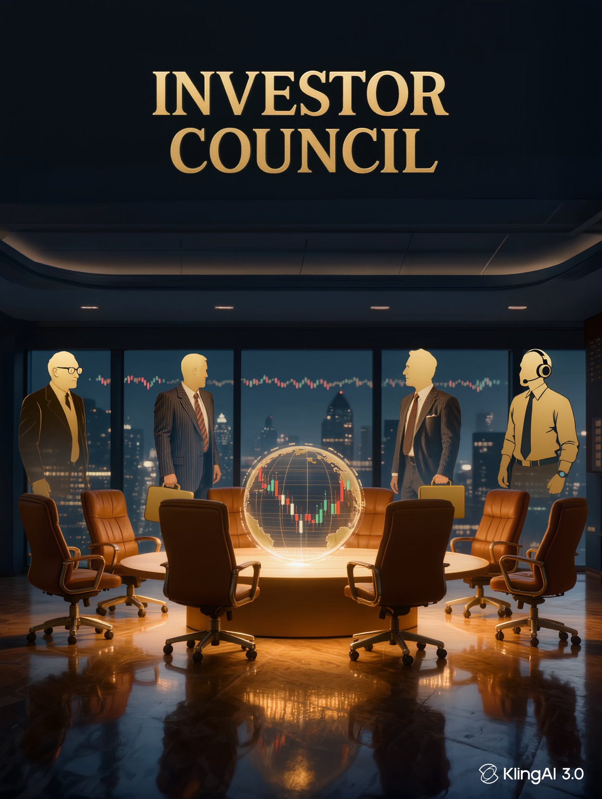

# Investor Council — Claude Code Skill


*Banner generated with [Kling AI](https://klingai.com)*

> ## ⚠️ IMPORTANT LEGAL DISCLAIMER
>
> **This is a fictional educational simulation. It is NOT financial advice.**
>
> - All investor personas are AI-generated approximations based solely on each person's
>   **publicly available books, interviews, shareholder letters, and documented philosophies**.
> - This project has **no affiliation with, endorsement from, or connection to** Warren Buffett,
>   Peter Lynch, Benjamin Graham (estate), George Soros, Ray Dalio, Cathie Wood, Charlie Munger
>   (estate), Berkshire Hathaway, ARK Invest, Bridgewater Associates, or any related firms.
> - **Nothing in this skill constitutes financial advice, investment advice, or any recommendation
>   to buy, sell, or hold any security, asset, or financial instrument.**
> - Simulated perspectives are approximations and may differ entirely from the real individuals'
>   actual views — past, present, or future.
> - Investing involves risk. You may lose money. Always consult a **licensed financial advisor**
>   regulated in your jurisdiction before making any investment decision.
> - By installing or using this skill you acknowledge it is for **educational and entertainment
>   purposes only.**

---

## What It Does

Convenes a fictional panel of 7 legendary investors, each analyzing your investment idea through
their own publicly documented philosophy. The value is in seeing genuine disagreement between
radically different frameworks — not in getting a recommendation.

## Council Members

| Member | Known For | Key Framework |
|---|---|---|
| Warren Buffett | Value investing | Moats, owner earnings, hold forever |
| Peter Lynch | GARP | "Invest in what you know", PEG ratio |
| Benjamin Graham | Deep value | Margin of safety, net-nets |
| George Soros | Macro / reflexivity | Self-reinforcing narrative loops |
| Ray Dalio | All-weather macro | Debt cycles, risk parity |
| Cathie Wood | Disruptive innovation | Wright's Law, 5-year TAM |
| Charlie Munger | Mental models | Inversion, lollapalooza effects |

## Install

```bash
claude plugin install github:YOUR_USERNAME/investor-council
```

## Usage

```
/investor-council NVIDIA at 35x P/E — worth buying?
/investor-council buffett What does Buffett's framework say about Bitcoin?
/investor-council compare Index funds vs individual stock picking
/investor-council devil Apple stock — argue the bear case
/investor-council debate Bitcoin as a store of value
/investor-council ghost I want to leverage up on crypto yield farming
/investor-council bias I bought Tesla at $400, now $180, feels like a deal
```

## Commands

| Command | What It Does |
|---|---|
| `/investor-council [idea]` | Full 7-member TL;DR table |
| `/investor-council [name] [idea]` | Single investor deep-dive |
| `/investor-council compare [A] vs [B]` | Head-to-head council vote |
| `/investor-council devil [idea]` | All members argue bear case |
| `/investor-council bull [idea]` | All members argue bull case |
| `/investor-council debate [idea]` | Two opposed members argue directly |
| `/investor-council ghost [idea]` | Historical blowup patterns that match |
| `/investor-council bias` | Detect cognitive biases in your framing |

## License

MIT — free to use, modify, and distribute with attribution.

## Contributing

PRs welcome. All contributions must maintain the educational disclaimer and must not introduce
any content that could be construed as financial advice.
